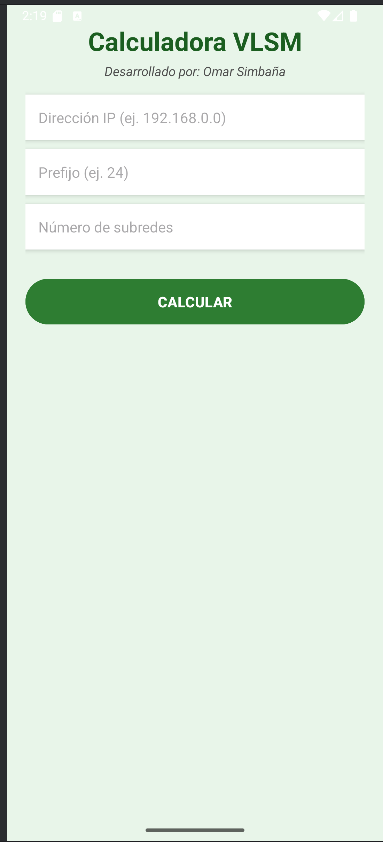
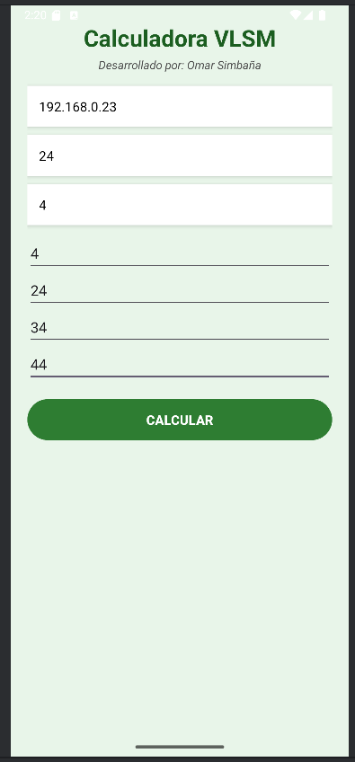
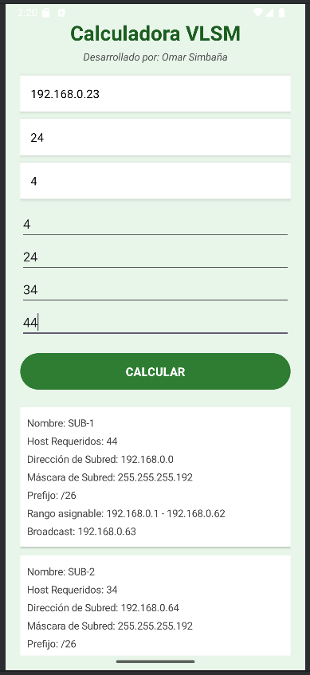
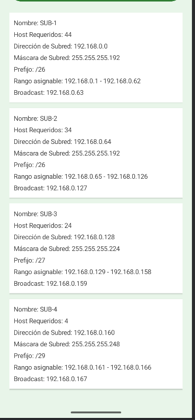

# 📱 Calculadora VLSM

Este proyecto calcula subredes utilizando VLSM y muestra los rangos, máscaras y direcciones relevantes.

---

## 📸 Evidencias

### 🧮 Pantalla principal

### ✅ formulario lleno 

### ✅ Calculo

### ✅ Resultados

---

## 🚀 Cómo usar

1. Ingresa una IP base y un prefijo
2. Ingresa la cantidad de subredes y los hosts necesarios
3. Pulsa “Calcular” y visualiza los resultados

---

## 👤 Autor

**Omar Simbana**
